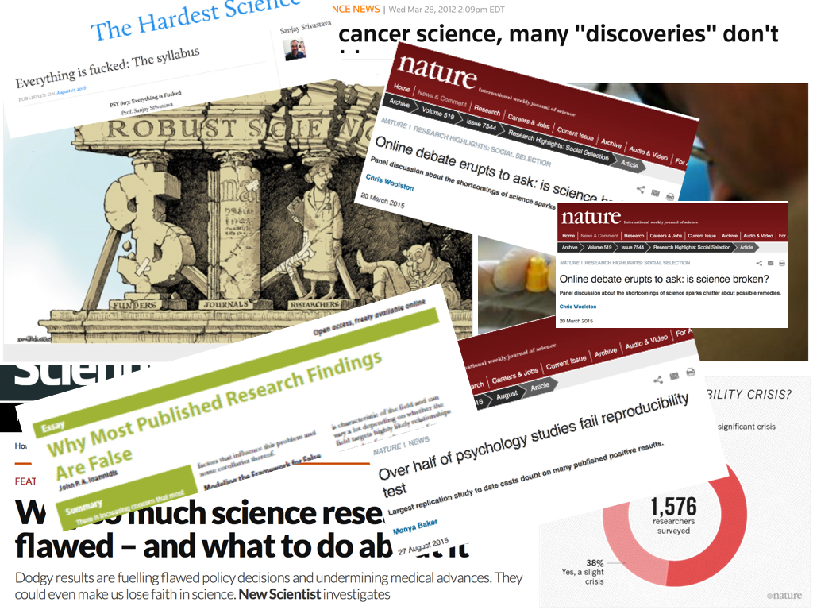
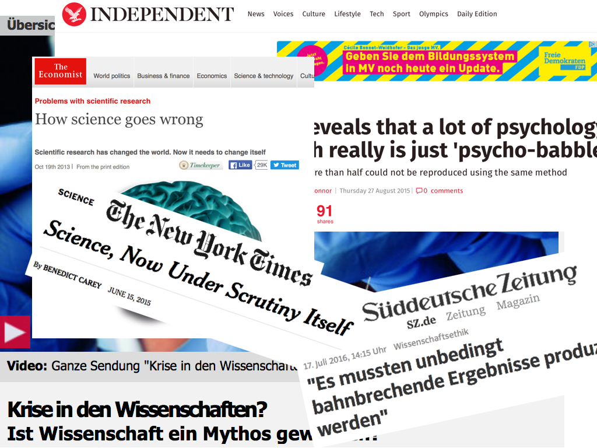
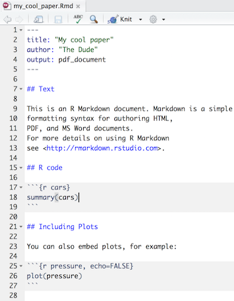
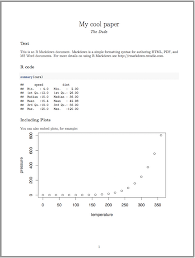
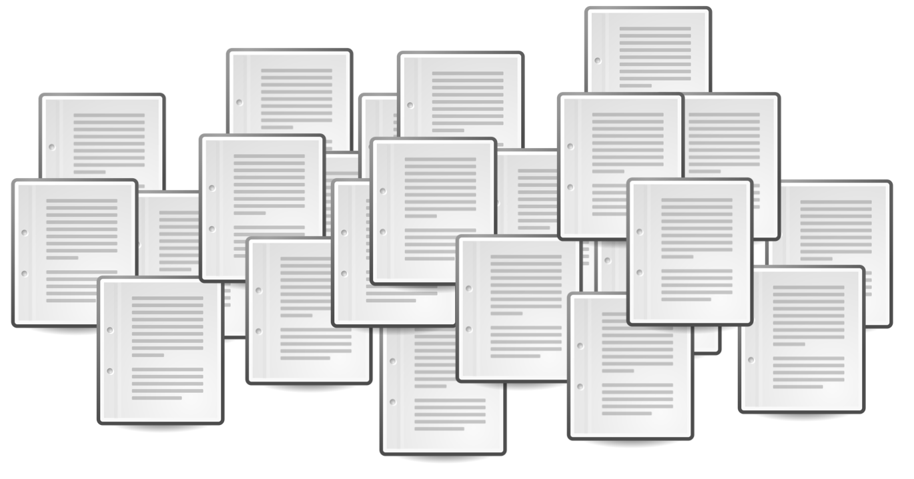
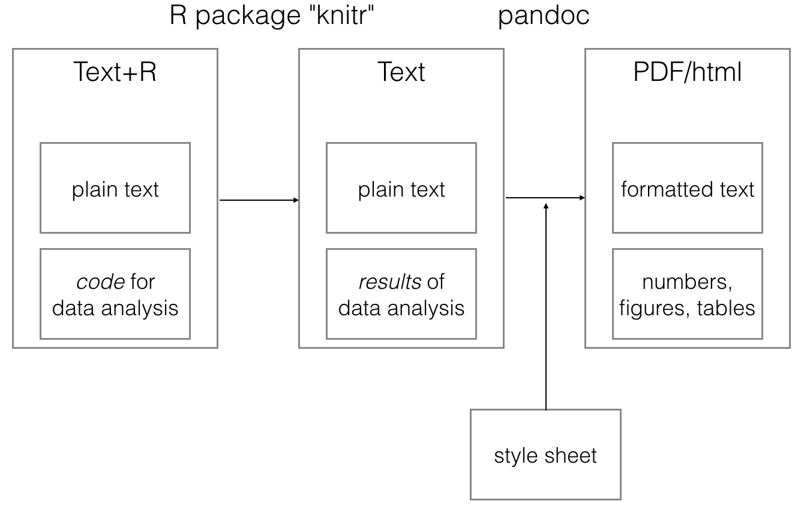
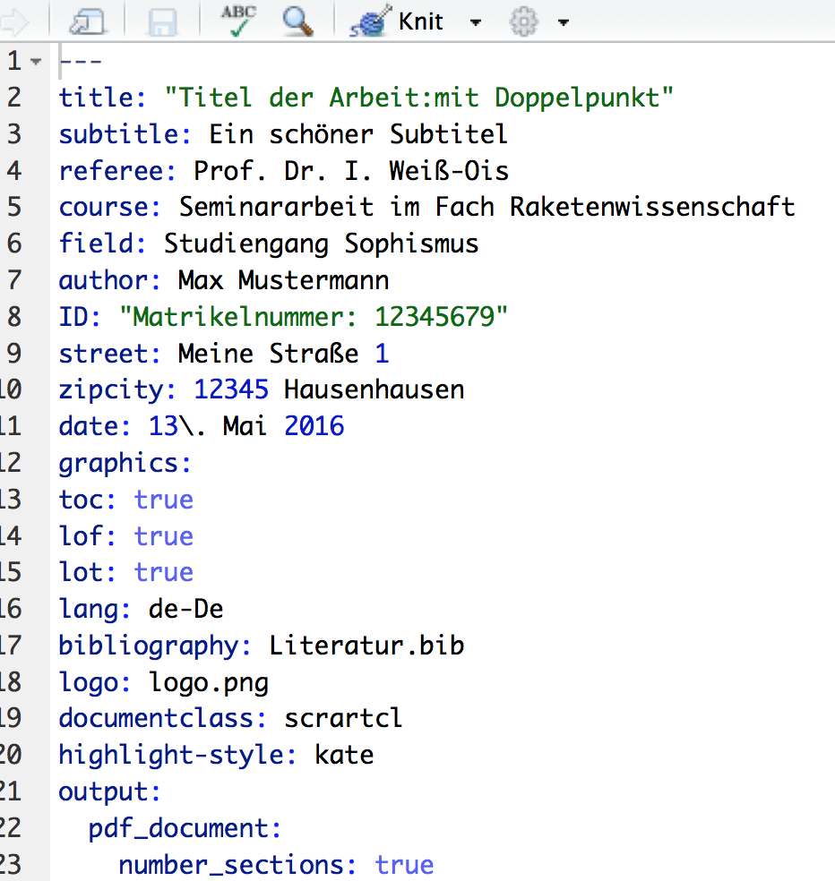
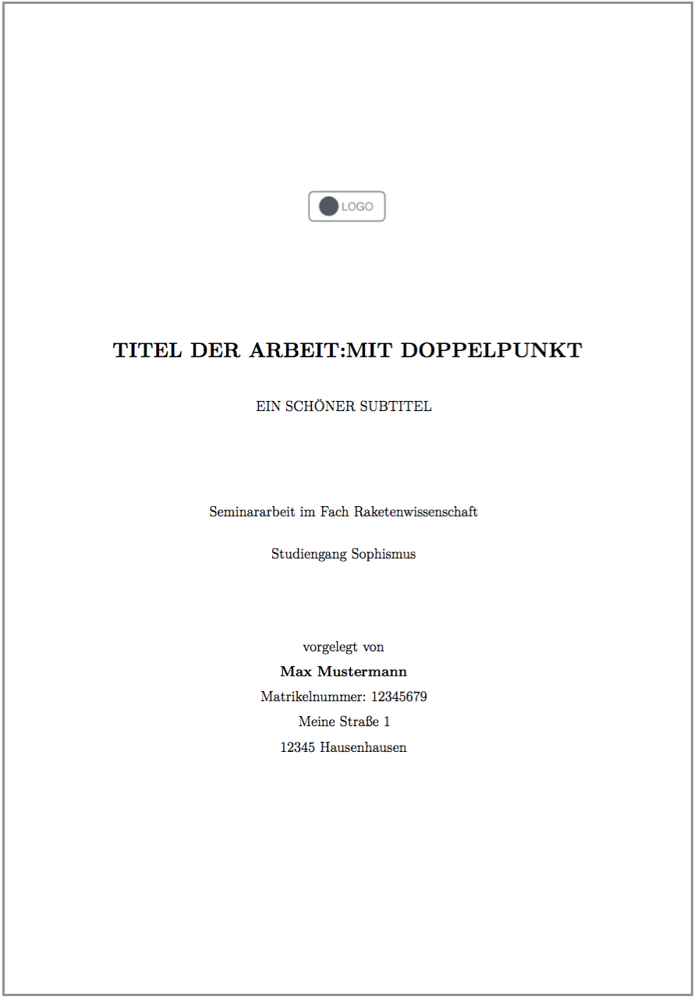
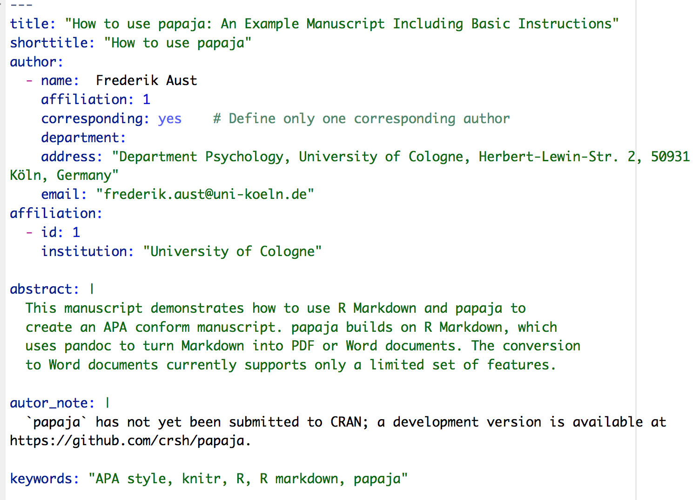

```{r, include = FALSE}
knitr::opts_chunk$set(dev="png", 
                      dev.args=list(type="cairo"),
                      dpi=96, 
                      echo = FALSE)
```


# Is science broken?


## Echo in academia press



## Echo in non-academia press




# What is reproducible writing?

## Write plain text with computer code included

{ width=50% }{ width=50% }


# Why should I write my paper in a reproducible manner?

## Re-do analysis with no pain

{ width=10% } 


> Dude,  
> I sent you the wrong data. Find attached new dataset. You must re-do all analyses.
> Did I mention we submit tommorrow?   
> Regards,  
  
> C. Kirk

## Match R code to results in paper easily


```{r fig.align = "center", out.width = "10cm"}

```


Paper with ~1,000 lines of wild R code. 


In results section:   
"After some wild computation, we found accuracy to be **78%**..."


# How to do it?

## Process of repro paper writing


```{r fig.align = "center", out.width = "10cm"}

```


# Style sheets

## Style sheet for thesis/assignment

{ width=50% } 


## Style sheet for APA papers

[Install PAPAJA](https://github.com/crsh/papaja) and open new APA template in RStudio
{ width=70% }


# Acknowledgments

## Acknowledgments/ more infos

- Yihui Xie for `knitr` - [more](http://kbroman.org/knitr_knutshell/)
- John Gruber & Aaron Swartz for `markdown` -  [more](https://github.com/adam-p/markdown-here/wiki/Markdown-Cheatsheet)
- John MacFarlane for `pandoc` - [more](http://pandoc.org)
- RStudio team for `RStudio` - [more](https://www.rstudio.com/home/)
- R community for `R` - [more](https://cran.r-project.org)
- Frederik Aust for `papaja` - [more](https://github.com/crsh/papaja)
- Get my thesis template -  [here](https://github.com/sebastiansauer/Markdown_paper_template)
- Github team for `github` - [more](https://github.com)
- Steven V. Miller for - [this beamer template](https://github.com/svmiller/svm-r-markdown-templates)


# That's it

## Thank you

- **Get slides etc. of this talk here**: <https://github.com/sebastiansauer/talk_repro_writing_DGPs_2016> 

- Contact: [sebastian.sauer@fom.de](sebastian.sauer@fom.de)


